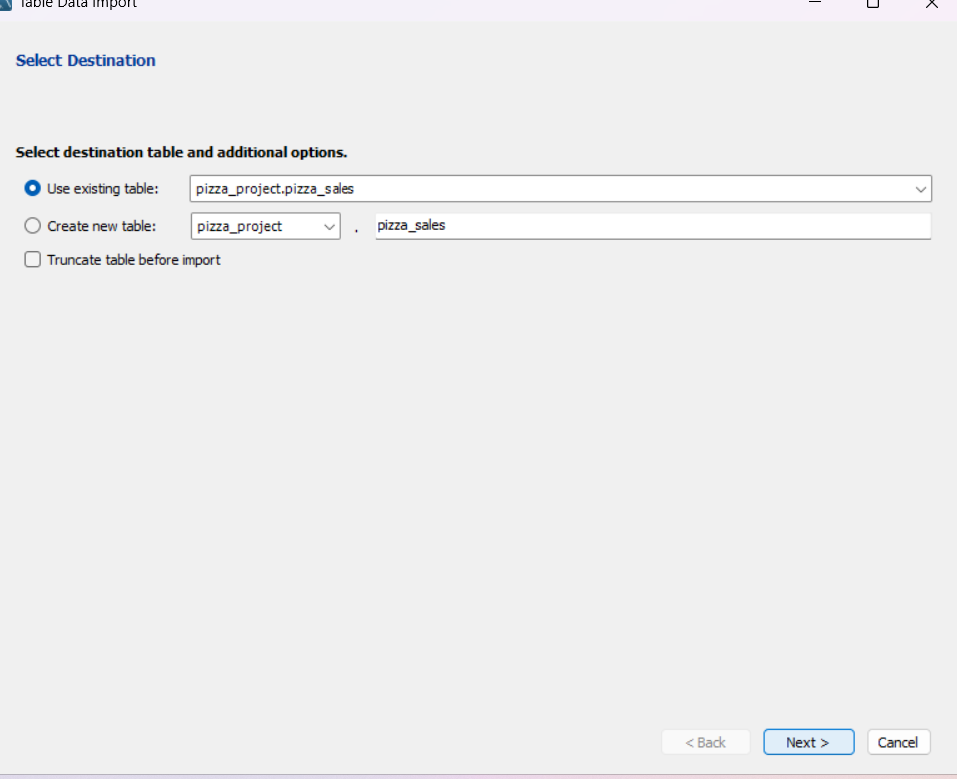
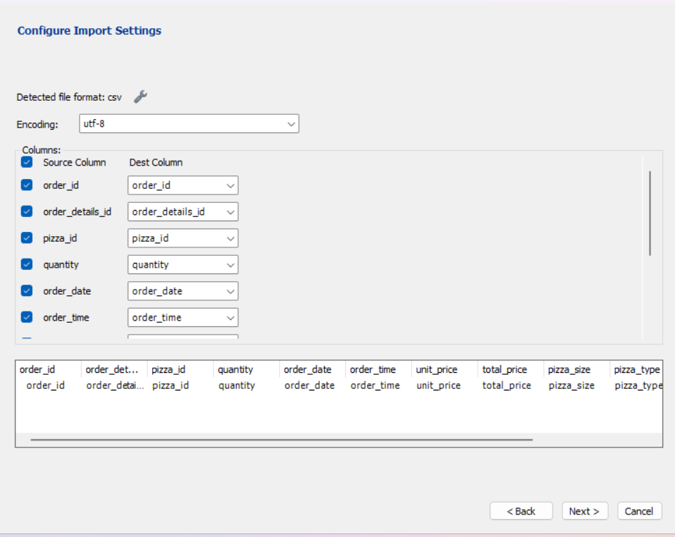
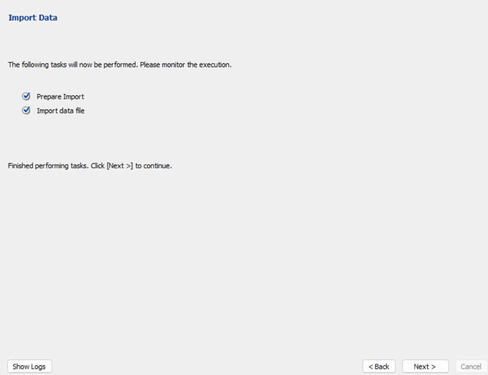
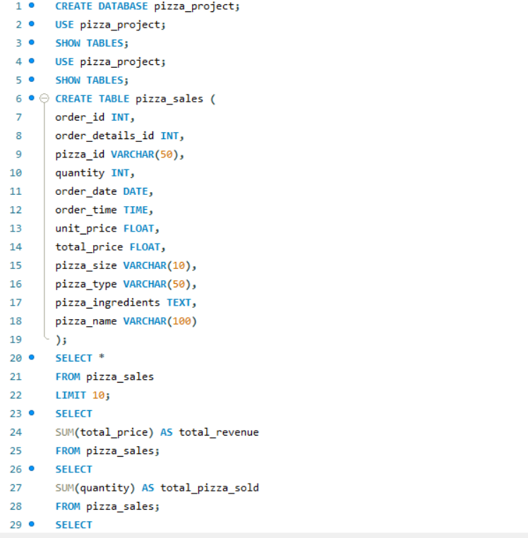
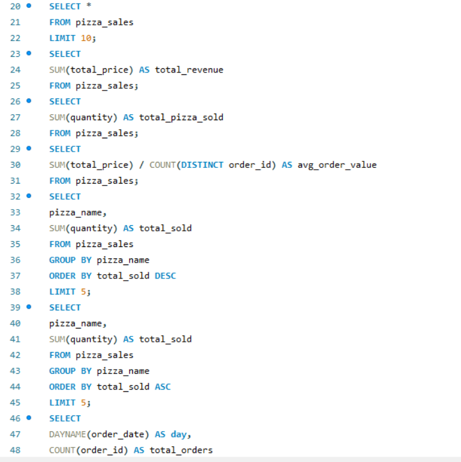
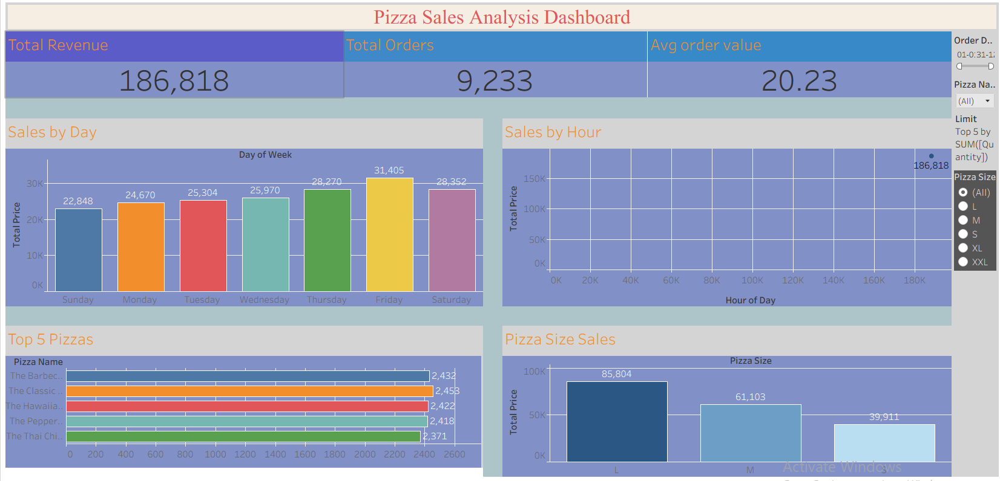

#  Pizza Sales Analysis Dashboard
Pizza Sales Analysis using SQL & Tableau

## Project Overview
This project analyzes pizza sales data to uncover business insights using SQL and Tableau.

## Objectives
- Analyze total revenue and orders
- Identify best and worst selling pizzas
- Understand sales trends by day and time
- Build an interactive dashboard

## Tools Used
- Excel (Data Cleaning)
- SQL (MySQL Workbench)
- Tableau (Dashboard)

## Dashboard Features
- Total Revenue, Total Orders, Avg Order Value
- Sales by Day & Hour
- Top 5 Best Selling Pizzas
- Revenue by Pizza Size
- Interactive Filters

## Key Insights
- Weekend sales are higher
- Evening hours have peak orders
- Large pizzas generate highest revenue
- Few pizzas contribute major sales

## Files Included
- Dataset (CSV)
- SQL Queries
- Tableau Dashboard File
- Project Report (PDF)

## SQL Analysis Output

## Dashboard Preview

